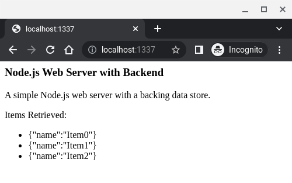

NodeJsWebServerWithBackend
==========================

The code in this repository implements a rudimentary web server with an even more rudimentary backend data store.  This code is intended mainly as a basis for further work.

Building and Running
--------------------

1. Clone or otherwise download this repository.
2. If necessary, download and install Node.js.
3a. On a Windows server, double-click the file Source/Run.bat.
3b. On a Unix server, run the command "./Run.sh" from the Source directory.  It may be necessary to make the script executable first, perhaps by running "chmod +x Run.sh" from the Source directory.
3c. If the scripts don't work, run the command "node NodeJsWebServerWithBackend.js" from the Source directory.
4. In a web browser, navigate to the URL http://localhost:1337.
5. Verify that the expected data is displayed.
